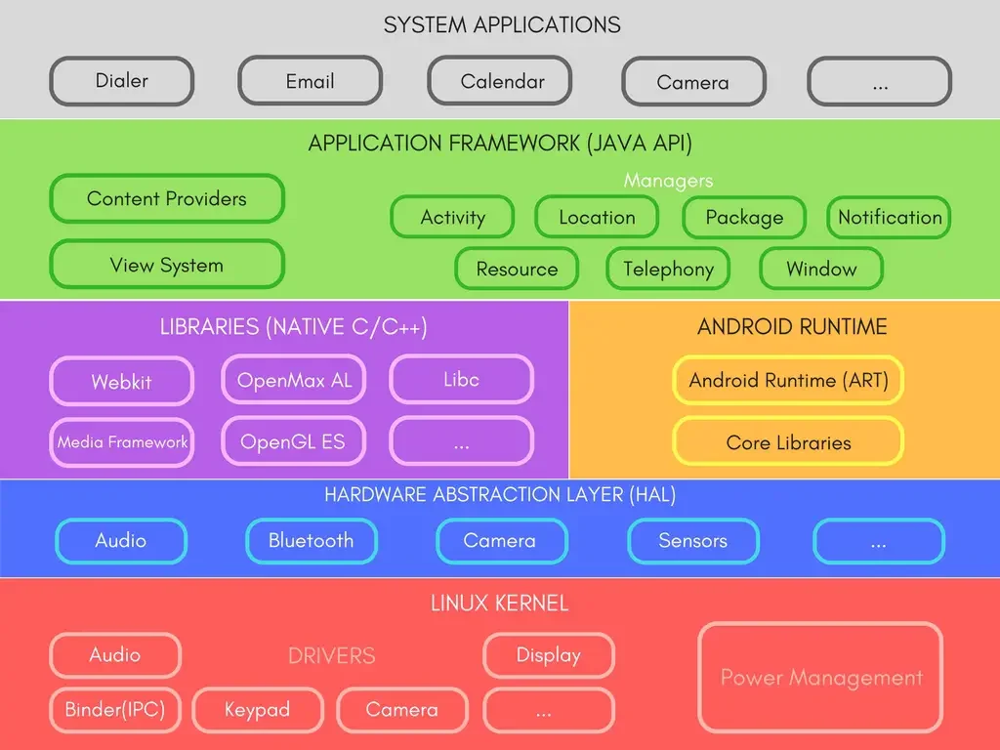

# AndroidDevelopement

Android Application I have created in MAD Lab


# MAD Lab

Date: 8-May-2023

ANDROID LABORATORY - PROGRAMS

Code: 14CSL77

### Table of Contents



## Kotlin Basics

1. **Android-related terms:**
    - **`android.gravity`**: Represents the gravity of a view (layout element) in Android. Gravity specifies the alignment of the view's contents within its layout bounds.
    - **`android.orientation`**: Refers to the orientation of a view or layout in Android. It can be either horizontal or vertical.
    - **`sp`** and **`dp`**: These are units used for specifying text and layout dimensions, respectively, in Android. **`sp`** stands for "scaled pixels," and it takes into account the user's font size preference, making it suitable for text sizing. **`dp`** stands for "density-independent pixels" and is used for layout dimensions, ensuring consistency across various screen densities.
    - **`MaterialComponents.DayNight.NoActionBar`**: This is likely a reference to a theme/style attribute in Android's Material Components library, which provides styles for supporting Day/Night themes without the ActionBar (the top app bar). This theme may be used to create applications that switch between light and dark themes.
    - AVD Manager: Emulator
    - **Cold boot:** It will start your device as if you’re turning it on for the first time.
    - **Quick boot**: It will remember the last state of your device and the next time you run the Android emulator it will show you the same screen.
    - **Snapshot**: This refers to the state of the Android emulator. You get to save the state yourself and it’ll kick off from the same page the next time you run the emulator.
2. **Kotlin Programming Language Concepts:**
    - **`${selectedMonth + 1}`**: This is a string interpolation in Kotlin. The value of **`selectedMonth`** is evaluated and then inserted into the string.
    - **`var`**: A keyword used to declare a mutable variable in Kotlin.
    - **`val`**: A keyword used to declare an immutable (read-only) variable in Kotlin.
    - **`//TODO:`**: This is a comment indicating that there is something yet to be done or implemented at that point in the code.
    - **`as?`**: This is the safe cast operator in Kotlin. It attempts to cast an object to the specified type and returns **`null`** if the casting fails instead of throwing an exception.
    - **`?.`**: The safe call operator. It is used to call a method or access a property on an object and returns **`null`** if the object itself is **`null`**.
    - **`!!`**: The not-null assertion operator. It is used to assert that an expression is not **`null`**, and it throws a **`NullPointerException`** if the assertion fails.
    - **`when`**: A powerful conditional expression in Kotlin that can be used as a replacement for **`switch`** in Java. It allows you to check multiple conditions and execute different code blocks based on the matched condition.
    - **`is`**: The type-checking operator in Kotlin. It is used to check if an object is of a specific type. It is similar to the **`instanceof`** operator in Java.
    - **`Smart Casting`**: In Kotlin, when a type check (using **`is`**) is performed, the compiler automatically casts the checked variable to the specified type within the scope of the conditional block if the check succeeds. This is known as smart casting.
    - **`lateinit`**: This keyword is used to declare a non-null variable that is not initialized immediately but is guaranteed to be initialized before its first use. It is commonly used with properties that are initialized later in the code.
    - **`?:`**: The Elvis operator in Kotlin. It is used as a shorthand for a null-check and provides an alternative value to use if the expression on the left-hand side is **`null`**.
    - **`data class`**: In Kotlin, a data class is a class designed to hold data/state. It automatically generates useful methods like **`toString()`**, **`equals()`**, and **`hashCode()`** based on the properties defined in the class.
    - **`open`**: The **`open`** keyword is used to indicate that a class or function can be subclassed or overridden by other classes.
3. **OOPs (Object-Oriented Programming) Concepts:**
    - **`Shadowing`**: This occurs when a variable with the same name as a class member is declared inside a method or constructor, effectively hiding the class member within the method's scope.
    - **`Primary Constructor`**: The primary constructor is defined in the class header, and it defines the properties of the class. The properties are initialized within the **`init`** block.
    - **`Secondary Constructor`**: Secondary constructors are additional constructors within a class that provide alternative ways to initialize the class properties. They call the primary constructor using the **`this`** keyword.
    - **`Super Constructor`**: When a subclass inherits from a superclass, it needs to call the superclass's constructor to initialize the inherited properties. This is done using the **`super`** keyword.
    - **`Abstract Class`**: An abstract class is a class that cannot be instantiated directly and may contain abstract (unimplemented) methods that must be overridden by its subclasses.
    - **`Interface`**: An interface in Kotlin defines a contract for classes that implement it. It contains abstract property declarations and/or method signatures. Classes can implement multiple interfaces.
    - **`Override`**: The **`override`** keyword is used to indicate that a method in a subclass is meant to override a method with the same signature in its superclass.
    - **`Enum Class`**: An enum class in Kotlin is used to define a type that represents a set of constant values. It is often used to represent a fixed set of options.
4. **Collections in Kotlin:**
    - **`Array`**: A fixed-size, mutable collection that holds elements of the same type.
    - **`List`**: An immutable, ordered collection that can contain elements of different types.
    - **`Set`**: An unordered collection that does not allow duplicate elements.
    - **`Map`**: A collection of key-value pairs, where each key is unique.
5. **Other Kotlin Concepts:**
    - **`Lambda Expression`**: A lambda expression is a concise way to represent a function or code block that can be passed around as an argument to higher-order functions or stored in variables.
    - **`Nested Class`**: A nested class is a class defined within another class, and it exists within the scope of the enclosing class.
    - **`Data Class`**: A data class is a class specifically designed to hold data and automatically generates useful methods like **`equals()`**, **`hashCode()`**, and **`toString()`** based on its properties.
    - **`Pair`** and **`Triple`**: These are utility classes in Kotlin used to store two or three related values, respectively, in a single object.
    - **`Enum Class`**: An enum class is used to define a type that represents a fixed set of constant values.
    - **`IllegalArgumentException`**: An exception thrown when a method receives an argument with an illegal or invalid value.
    - **`IllegalStateException`**: An exception thrown when the internal state of an object or system is incorrect or unexpected.

## Programs

### 1. Hello World

In this lab we will be learning how to use and extend the Android user interface library.

1. Views, View Groups, Layouts, and Widgets are and how they relate to each other.
2. How to declare and reference resources in code.
3. How to navigate between multiple activities.
4. How to share the data between the activities.
5. Explore life-cycle methods of an activity.
6. How to use Events and Event Listeners.
7. How to create Toast Notifications.

MainActivity.kt

```kotlin
package com.example.helloworld

import androidx.appcompat.app.AppCompatActivity
import android.os.Bundle
import android.util.Log
import android.widget.Button
import android.widget.Toast

class MainActivity : AppCompatActivity() {
    override fun onCreate(savedInstanceState: Bundle?) {
        super.onCreate(savedInstanceState)
        setContentView(R.layout.activity_main)
        var count = 0
        val btn = findViewById<Button>(R.id.clickButtton)
        btn.setOnClickListener {
            count+=1
            btn.text = "Clicked"+count.toString()+"times";
            Log.v("Buton Click","Button Clicked" )
            Toast.makeText(this,"You Clickn' me? ",Toast.LENGTH_LONG).show()
        }
    }
}
```

activity_main.xml

```xml
<?xml version="1.0" encoding="utf-8"?>
<androidx.constraintlayout.widget.ConstraintLayout xmlns:android="http://schemas.android.com/apk/res/android"
    xmlns:app="http://schemas.android.com/apk/res-auto"
    xmlns:tools="http://schemas.android.com/tools"
    android:layout_width="match_parent"
    android:layout_height="match_parent"
    tools:context=".MainActivity">

    <TextView
        android:id="@+id/introText"
        android:layout_width="285dp"
        android:layout_height="41dp"
        android:layout_marginTop="32dp"
        android:layout_marginBottom="173dp"
        android:text="@string/Anant_Intro"
        android:textColor="@color/purple_200"
        app:layout_constraintBottom_toTopOf="@+id/clickButtton"
        app:layout_constraintEnd_toEndOf="parent"
        app:layout_constraintStart_toStartOf="parent"
        app:layout_constraintTop_toBottomOf="@+id/actorPic" />

    <Button
        android:id="@+id/clickButtton"
        android:layout_width="wrap_content"
        android:layout_height="wrap_content"
        android:layout_marginTop="152dp"
        android:text="Hello There"
        app:layout_constraintEnd_toEndOf="parent"
        app:layout_constraintStart_toStartOf="parent"
        app:layout_constraintTop_toBottomOf="@+id/introText" />

</androidx.constraintlayout.widget.ConstraintLayout>
```

### 2. Drop Down Menu

You will expand on your knowledge of the Android user interface library.

1. How to declare layouts statically as an xml resource.
2. How to create custom Views from scratch to suit a specific need.
3. How to create Options and Context Menus.
4. How to use ListAdapter and ArrayAdapter to bind data source to a List View.
5. How to create AlertDialog and progress Dialog in your activity.

MainActivity.kt

```kotlin
package com.example.menu

import android.os.Bundle
import android.view.ContextMenu
import android.view.MenuItem
import android.view.View
import android.widget.Button
import android.widget.Toast
import androidx.appcompat.app.AppCompatActivity

class MainActivity : AppCompatActivity() {
    private lateinit var button: Button

    override fun onCreate(savedInstanceState: Bundle?) {
        super.onCreate(savedInstanceState)
        setContentView(R.layout.activity_main)

        button = findViewById(R.id.button)
        registerForContextMenu(button)
    }

    override fun onCreateContextMenu(
        menu: ContextMenu?,
        v: View?,
        menuInfo: ContextMenu.ContextMenuInfo?
    ) {
        menuInflater.inflate(R.menu.menu, menu)
        super.onCreateContextMenu(menu, v, menuInfo)
    }

    override fun onContextItemSelected(item: MenuItem): Boolean {
        Toast.makeText(this, "" + item.title, Toast.LENGTH_SHORT).show()
        return super.onContextItemSelected(item)
    }
}
```

1. The **`registerForContextMenu`** function is called with a button as its parameter. This function registers the button for a context menu, which means that when the user long-presses the button, the context menu will appear.
2. The **`onCreateContextMenu`** function is an override method that is called when the context menu is created. It takes three parameters: **`menu`**, **`v`**, and **`menuInfo`**. In this function, the **`menuInflater`** is used to inflate a menu resource file **`R.menu.menu`** into the **`menu`** parameter. This menu resource file contains the items that will appear in the context menu.
3. The **`onContextItemSelected`** function is an override method that is called when an item in the context menu is selected. It takes an argument **`item`** that represents the menu item that was selected. In this function, a **`Toast`** is created to display the title of the selected menu item.

activity_main.xml

```xml
<?xml version="1.0" encoding="utf-8"?>
<androidx.constraintlayout.widget.ConstraintLayout
    xmlns:android="http://schemas.android.com/apk/res/android"
    xmlns:app="http://schemas.android.com/apk/res-auto"
    xmlns:tools="http://schemas.android.com/tools"
    android:layout_width="match_parent"
    android:layout_height="match_parent"
    tools:context=".MainActivity"
    tools:visibility="visible">

    <Button
        android:id="@+id/button"
        android:layout_width="wrap_content"
        android:layout_height="wrap_content"
        android:text="Long Click on Me"
        android:textSize="25sp"
        android:visibility="visible"
        app:layout_constraintBottom_toBottomOf="parent"
        app:layout_constraintLeft_toLeftOf="parent"
        app:layout_constraintRight_toRightOf="parent"
        app:layout_constraintTop_toTopOf="parent" />

</androidx.constraintlayout.widget.ConstraintLayout>
```

menu.xml

```xml
<menu xmlns:android="http://schemas.android.com/apk/res/android">
    <item
        android:title="@string/one"
        />
    <item
        android:title="@string/two"
        />
    <item
        android:title="@string/three"
        />
    <item
        android:title="@string/four"
        />
    <item
        android:title="@string/five"
        />
</menu>
```

### 3. Form

You will be persisting data using an SQLite Database and preserving the state of an application during its lifecycle.

1. How to save & restore data as Application Preferences (Shared Preference).
2. How to save & restore data as Instance State.
3. How to create and manage an SQLite database in Android.
4. **How to insert, update, remove, and retrieve data from an SQLite Database.
5. **Display data using RecyclerView.

MainActivity.kt

```kotlin
package com.example.crudform

import androidx.appcompat.app.AlertDialog
import androidx.appcompat.app.AppCompatActivity
import android.database.Cursor
import android.os.Bundle
import android.view.View
import android.widget.Button
import android.widget.EditText
import android.widget.Toast

class MainActivity : AppCompatActivity() {
    private lateinit var name: EditText
    private lateinit var contact: EditText
    private lateinit var dob: EditText
    private lateinit var insert: Button
    private lateinit var update: Button
    private lateinit var delete: Button
    private lateinit var view: Button
    private lateinit var dB: DBHelper
    override fun onCreate(savedInstanceState: Bundle?) {
        super.onCreate(savedInstanceState)
        setContentView(R.layout.activity_main)

        name = findViewById(R.id.name)
        contact = findViewById(R.id.contact)
        dob = findViewById(R.id.dob)
        insert = findViewById(R.id.btnInsert)
        update = findViewById(R.id.btnUpdate)
        delete = findViewById(R.id.btnDelete)
        view = findViewById(R.id.btnView)
        dB = DBHelper(this)

        insert.setOnClickListener {
            val nameTXT = name.text.toString()
            val contactTXT = contact.text.toString()
            val dobTXT = dob.text.toString()
            val checkinsertdata = dB.insertuserdata(nameTXT, contactTXT, dobTXT)
            if (checkinsertdata == true)
                Toast.makeText(this, "New Entry Inserted", Toast.LENGTH_SHORT).show()
            else
                Toast.makeText(this, "New Entry Not Inserted", Toast.LENGTH_SHORT).show()
        }

        update.setOnClickListener {
            val nameTXT = name.text.toString()
            val contactTXT = contact.text.toString()
            val dobTXT = dob.text.toString()
            val checkupdatedata = dB.updateuserdata(nameTXT, contactTXT, dobTXT)
            if (checkupdatedata == true)
                Toast.makeText(this, "Entry Updated", Toast.LENGTH_SHORT).show()
            else
                Toast.makeText(this, "New Entry Not Updated", Toast.LENGTH_SHORT).show()
        }

        delete.setOnClickListener {
            val nameTXT = name.text.toString()
            val checkudeletedata = dB.deletedata(nameTXT)
            if (checkudeletedata == true)
                Toast.makeText(this, "Entry Deleted", Toast.LENGTH_SHORT).show()
            else
                Toast.makeText(this, "Entry Not Deleted", Toast.LENGTH_SHORT).show()
        }

        view.setOnClickListener {
            val res: Cursor = dB.getdata()
            if (res.getCount() == 0) {
                Toast.makeText(this, "No Entry Exists", Toast.LENGTH_SHORT).show()
                return@setOnClickListener
            }
            val buffer = StringBuffer()
            while (res.moveToNext()) {
                buffer.append("Name :" + res.getString(0) + "\n")
                buffer.append("Contact :" + res.getString(1) + "\n")
                buffer.append("Date of Birth :" + res.getString(2) + "\n\n")
            }
            val builder = AlertDialog.Builder(this)
            builder.setCancelable(true)
            builder.setTitle("User Entries")
            builder.setMessage(buffer.toString())
            builder.show()
        }
    }
}
```

DBHelper.kt

```kotlin
package com.example.crudform

import android.content.ContentValues
import android.content.Context
import android.database.Cursor
import android.database.sqlite.SQLiteDatabase
import android.database.sqlite.SQLiteOpenHelper

class DBHelper(context: Context) : SQLiteOpenHelper(context, "Userdata.db", null, 1) {

    override fun onCreate(DB: SQLiteDatabase) {
        DB.execSQL("create Table Userdetails(name TEXT primary key, contact TEXT, dob TEXT)")
    }

    override fun onUpgrade(DB: SQLiteDatabase, i: Int, ii: Int) {
        DB.execSQL("drop Table if exists Userdetails")
    }

    fun insertuserdata(name: String, contact: String, dob: String): Boolean {
        val DB = this.writableDatabase
        val contentValues = ContentValues()
        contentValues.put("name", name)
        contentValues.put("contact", contact)
        contentValues.put("dob", dob)
        val result = DB.insert("Userdetails", null, contentValues)
        return result != -1L
    }

    fun updateuserdata(name: String, contact: String, dob: String): Boolean {
        val DB = this.writableDatabase
        val contentValues = ContentValues()
        contentValues.put("contact", contact)
        contentValues.put("dob", dob)
        val cursor: Cursor = DB.rawQuery("Select * from Userdetails where name = ?", arrayOf(name))
        return if (cursor.count > 0) {
            val result = DB.update("Userdetails", contentValues, "name=?", arrayOf(name))
            result != -1
        } else {
            false
        }
    }

    fun deletedata(name: String): Boolean {
        val DB = this.writableDatabase
        val cursor: Cursor = DB.rawQuery("Select * from Userdetails where name = ?", arrayOf(name))
        return if (cursor.count > 0) {
            val result = DB.delete("Userdetails", "name=?", arrayOf(name))
            result != -1
        } else {
            false
        }
    }

    fun getdata(): Cursor {
        val DB = this.writableDatabase
        return DB.rawQuery("Select * from Userdetails", null)
    }
}
```

activity_main.xml

```xml
<?xml version="1.0" encoding="utf-8"?>
<RelativeLayout xmlns:android="http://schemas.android.com/apk/res/android"
    xmlns:app="http://schemas.android.com/apk/res-auto"
    xmlns:tools="http://schemas.android.com/tools"
    android:layout_width="match_parent"
    android:layout_height="match_parent"
    android:padding="10dp"
    tools:context=".MainActivity">
    <TextView
        android:id="@+id/texttitle"
        android:layout_width="match_parent"
        android:layout_height="wrap_content"
        android:text="Please enter the details below"
        android:textSize="24dp"
        android:layout_marginTop="20dp"/>
    <EditText
        android:id="@+id/name"
        android:layout_width="match_parent"
        android:layout_height="wrap_content"
        android:layout_below="@+id/texttitle"
        android:hint="Name"
        android:inputType="textPersonName"
        android:textSize="24dp" />
    <EditText
        android:id="@+id/contact"
        android:layout_width="match_parent"
        android:layout_height="wrap_content"
        android:layout_below="@+id/name"
        android:hint="Contact"
        android:inputType="number"
        android:textSize="24dp" />
    <EditText
        android:id="@+id/dob"
        android:layout_width="match_parent"
        android:layout_height="wrap_content"
        android:layout_below="@+id/contact"
        android:hint="Date of Birth"
        android:inputType="number"
        android:textSize="24dp" />
    <Button
        android:id="@+id/btnInsert"
        android:layout_width="match_parent"
        android:layout_height="wrap_content"
        android:layout_below="@id/dob"
        android:layout_marginTop="30dp"
        android:text="Insert New Data"
        android:textSize="24dp" />
    <Button
        android:id="@+id/btnUpdate"
        android:layout_width="match_parent"
        android:layout_height="wrap_content"
        android:layout_below="@id/btnInsert"
        android:text="Update Data"
        android:textSize="24dp" />
    <Button
        android:id="@+id/btnDelete"
        android:layout_width="match_parent"
        android:layout_height="wrap_content"
        android:layout_below="@id/btnUpdate"
        android:text="Delete Existing Data"
        android:textSize="24dp" />
    <Button
        android:id="@+id/btnView"
        android:layout_width="match_parent"
        android:layout_height="wrap_content"
        android:layout_below="@id/btnDelete"
        android:text="View Data"
        android:textSize="24dp" />
</RelativeLayout>
```


### 4. Camera

Develop an app to capture a photo and store it into SDCard, extend this app to display all the photos capture in the grid view.

1. How to use the Camera.
2. How to write data to the SD card.

AndroidMAnifest.xml

```xml
<uses-permission android:name="android.permission.CAMERA" />
<uses-permission android:name="android.permission.WRITE_EXTERNAL_STORAGE" />
```

MainActivity.kt

```kotlin
package com.example.camera

import android.Manifest
import android.content.Intent
import android.content.pm.PackageManager
import android.graphics.Bitmap
import android.graphics.BitmapFactory
import android.net.Uri
import android.os.Bundle
import android.os.Environment
import android.provider.MediaStore
import android.widget.Button
import android.widget.ImageView
import android.widget.Toast
import androidx.activity.result.ActivityResultLauncher
import androidx.activity.result.contract.ActivityResultContracts
import androidx.appcompat.app.AppCompatActivity
import androidx.core.app.ActivityCompat
import androidx.core.content.ContextCompat
import java.io.File
import java.io.FileOutputStream
import java.io.InputStream

class MainActivity : AppCompatActivity() {

    private val CAMERA_REQ_CODE = 100
    private lateinit var imgCamera: ImageView
    private lateinit var cameraBtn: Button
    private lateinit var selectImgBtn: Button
    private lateinit var storagePermissionLauncher: ActivityResultLauncher<String>
    private lateinit var selectImageLauncher: ActivityResultLauncher<Intent>

    override fun onCreate(savedInstanceState: Bundle?) {
        super.onCreate(savedInstanceState)
        setContentView(R.layout.activity_main)

        imgCamera = findViewById(R.id.camImg)
        cameraBtn = findViewById(R.id.cameraBtn)

        cameraBtn.setOnClickListener {
            val iCamera = Intent(MediaStore.ACTION_IMAGE_CAPTURE)
            if (ContextCompat.checkSelfPermission(this, Manifest.permission.CAMERA) != PackageManager.PERMISSION_GRANTED) {
                ActivityCompat.requestPermissions(this, arrayOf(Manifest.permission.CAMERA), CAMERA_REQ_CODE)
            } else {
                // Launch the camera intent
                cameraLauncher.launch(iCamera)
            }

        }

        selectImgBtn = findViewById(R.id.selectImgBtn)

        selectImgBtn.setOnClickListener {
            if (ContextCompat.checkSelfPermission(
                    applicationContext, Manifest.permission.READ_EXTERNAL_STORAGE
                ) != PackageManager.PERMISSION_GRANTED) {
                storagePermissionLauncher.launch(Manifest.permission.READ_EXTERNAL_STORAGE)
            } else {
                selectImageLauncher.launch(Intent(Intent.ACTION_PICK, MediaStore.Images.Media.EXTERNAL_CONTENT_URI))
            }
        }

        storagePermissionLauncher = registerForActivityResult(ActivityResultContracts.RequestPermission()) { isGranted: Boolean ->
            if (isGranted) {
                selectImageLauncher.launch(Intent(Intent.ACTION_PICK, MediaStore.Images.Media.EXTERNAL_CONTENT_URI))
            } else {
                Toast.makeText(this, "Permission Denied", Toast.LENGTH_SHORT).show()
            }
        }

        selectImageLauncher = registerForActivityResult(ActivityResultContracts.StartActivityForResult()) { result ->
            if (result.resultCode == RESULT_OK) {
                val selectedImageUri: Uri? = result.data?.data
                if (selectedImageUri != null) {
                    try {
                        val inputStream: InputStream? = contentResolver.openInputStream(selectedImageUri)
                        val bitmap = BitmapFactory.decodeStream(inputStream)
                        imgCamera.setImageBitmap(bitmap)
                    } catch (exception: Exception) {
                        Toast.makeText(this, exception.message, Toast.LENGTH_SHORT).show()
                    }
                }
            }
        }
    }

    private val cameraLauncher = registerForActivityResult(ActivityResultContracts.StartActivityForResult()) { result ->
        if (result.resultCode == RESULT_OK) {
            val img = result.data?.extras?.get("data") as? Bitmap
            img?.let {
                imgCamera.setImageBitmap(it)
                // Save the image to SDCard
                val imageFile = File(Environment.getExternalStoragePublicDirectory(Environment.DIRECTORY_PICTURES), "captured_image.jpg")
                val outputStream = FileOutputStream(imageFile)
                it.compress(Bitmap.CompressFormat.JPEG, 100, outputStream)
                outputStream.flush()
                outputStream.close()
            }
        }
    }
}
```

activity_main.xml

```xml
<?xml version="1.0" encoding="utf-8"?>
<androidx.constraintlayout.widget.ConstraintLayout xmlns:android="http://schemas.android.com/apk/res/android"
    xmlns:app="http://schemas.android.com/apk/res-auto"
    xmlns:tools="http://schemas.android.com/tools"
    android:layout_width="match_parent"
    android:layout_height="match_parent"
    tools:context=".MainActivity">

    <ImageView
        android:id="@+id/camImg"
        android:layout_width="0dp"
        android:layout_height="0dp"
        android:layout_marginTop="20dp"
        android:layout_marginBottom="100dp"
        android:adjustViewBounds="false"
        android:scaleType="fitCenter"
        app:layout_constraintBottom_toTopOf="@+id/cameraBtn"
        app:layout_constraintEnd_toEndOf="parent"
        app:layout_constraintHorizontal_bias="0.0"
        app:layout_constraintStart_toStartOf="parent"
        app:layout_constraintTop_toTopOf="parent"
        app:srcCompat="@color/black" />

    <Button
        android:id="@+id/cameraBtn"
        android:layout_width="0dp"
        android:layout_height="wrap_content"
        android:layout_marginBottom="10dp"
        android:text="Open Camera"
        app:layout_constraintBottom_toTopOf="@+id/selectImgBtn"
        app:layout_constraintEnd_toEndOf="parent"
        app:layout_constraintHorizontal_bias="0.0"
        app:layout_constraintStart_toStartOf="parent" />

    <Button
        android:id="@+id/selectImgBtn"
        android:layout_width="0dp"
        android:layout_height="wrap_content"
        android:layout_marginBottom="50dp"
        android:text="Select Image"
        app:layout_constraintBottom_toBottomOf="parent"
        app:layout_constraintEnd_toEndOf="parent"
        app:layout_constraintHorizontal_bias="0.0"
        app:layout_constraintStart_toStartOf="parent" />
</androidx.constraintlayout.widget.ConstraintLayout>
```


### 5. SMS

Create an application to demonstrate a few key features of the Android framework. In particular, the application demonstrates how to send SMS text messages.

1. How to send SMS text messages.
2. How to dial using an in-built dialer
3. How to send email.

MainActivity.kt

```kotlin
package com.example.sendsms

import android.content.Intent
import android.content.pm.PackageManager
import android.net.Uri
import androidx.appcompat.app.AppCompatActivity
import android.os.Bundle
import android.view.View
import android.widget.Button
import androidx.core.app.ActivityCompat

class MainActivity : AppCompatActivity() {
    //val REQUEST_CALL_PHONE_PERMISSION = 1
    override fun onCreate(savedInstanceState: Bundle?) {
        super.onCreate(savedInstanceState)
        setContentView(R.layout.activity_main)
        val cal = findViewById<Button>(R.id.call)
        val msg = findViewById<Button>(R.id.message)
        val mail = findViewById<Button>(R.id.mail)

        cal.setOnClickListener(object : View.OnClickListener{
            override fun onClick(p0: View?) {
                call()
            }
        })
        msg.setOnClickListener(object : View.OnClickListener{
            override fun onClick(p0: View?) {
                message()
            }
        })
        mail.setOnClickListener(object : View.OnClickListener{
            override fun onClick(p0: View?) {
                mail()
            }
        })
    }

    fun call() {
        val intent = Intent(Intent.ACTION_DIAL, Uri.parse("tel:+917483201544"))
        //intent.data = Uri.parse("tel:+917483201544")
        startActivity(intent)
    }
    fun message() {
        val phoneNumber = "1234567890"
        val message = "Hello, this is a test message"
        val intent = Intent(Intent.ACTION_SENDTO).apply {
            data = Uri.parse("smsto:$phoneNumber")
            putExtra("sms_body", message)
        }
        startActivity(intent)
    }
    fun mail() {
        val intent = Intent(Intent.ACTION_SENDTO)
        intent.data = Uri.parse("mailto:anantashayana.hegde@gmail.com")
        intent.putExtra(Intent.EXTRA_SUBJECT, "Sub:Leave")
        intent.putExtra(Intent.EXTRA_TEXT, "Iam absent")
        startActivity(intent)
    }
}
```

activity_main.xml

```xml
<?xml version="1.0" encoding="utf-8"?>
<androidx.constraintlayout.widget.ConstraintLayout xmlns:android="http://schemas.android.com/apk/res/android"
    xmlns:app="http://schemas.android.com/apk/res-auto"
    xmlns:tools="http://schemas.android.com/tools"
    android:layout_width="match_parent"
    android:layout_height="match_parent"
    tools:context=".MainActivity">

    <TextView
        android:id="@+id/Heading"
        android:layout_width="wrap_content"
        android:layout_height="wrap_content"
        android:layout_marginTop="47dp"
        android:text="Click on what you want to do"
        app:layout_constraintEnd_toEndOf="parent"
        app:layout_constraintStart_toStartOf="parent"
        app:layout_constraintTop_toTopOf="parent" />

    <Button
        android:id="@+id/call"
        android:layout_width="wrap_content"
        android:layout_height="wrap_content"
        android:layout_marginEnd="11dp"
        android:text="Call"
        app:layout_constraintBaseline_toBaselineOf="@+id/message"
        app:layout_constraintEnd_toStartOf="@+id/message"
        app:layout_constraintStart_toStartOf="parent" />

    <Button
        android:id="@+id/message"
        android:layout_width="wrap_content"
        android:layout_height="wrap_content"
        android:layout_marginTop="105dp"
        android:layout_marginEnd="9dp"
        android:text="Message"
        app:layout_constraintEnd_toStartOf="@+id/mail"
        app:layout_constraintStart_toEndOf="@+id/call"
        app:layout_constraintTop_toBottomOf="@+id/Heading" />

    <Button
        android:id="@+id/mail"
        android:layout_width="wrap_content"
        android:layout_height="wrap_content"
        android:layout_marginEnd="2dp"
        android:text="Mail"
        app:layout_constraintBaseline_toBaselineOf="@+id/message"
        app:layout_constraintEnd_toEndOf="parent"
        app:layout_constraintStart_toEndOf="@+id/message" />
</androidx.constraintlayout.widget.ConstraintLayout>
```

AndroidManifest.xml

```xml
<uses-permission android:name="android.permission.SEND_SMS" />
<uses-permission android:name="android.permission.CALL_PHONE" />
<uses-permission android:name="android.permission.SEND_EMAIL" />
```

### 6. Miss call and Contacts

Develop an app that include broadcast Receiver to receive the miss calls from the Known number and display it to the user using notification services. This same app should also fetch phone number from the inbuilt contacts using the concept of content provider.

1. How to use broadcast receiver and notifications.
2. How to use content providers.

### Notification

AndroidManifest.xml

```xml
<uses-permission android:name="android.permission.POST_NOTIFICATIONS" />
<uses-permission android:name="android.permission.VIBRATE" />
<uses-permission android:name="android.permission.INTERNET" />
```

MainActivity.kt

```kotlin
package com.example.SimpleNotification

import android.annotation.SuppressLint
import android.app.NotificationChannel
import android.app.NotificationManager
import android.content.Context
import android.os.Build
import androidx.appcompat.app.AppCompatActivity
import android.os.Bundle
import android.widget.Button
import androidx.core.app.NotificationCompat
import androidx.core.app.NotificationManagerCompat
import com.example.misscallnotifier.R

class MainActivity : AppCompatActivity() {
    val CHANNEL_ID = "3"

    @SuppressLint("MissingPermission")
    override fun onCreate(savedInstanceState: Bundle?) {
        super.onCreate(savedInstanceState)
        setContentView(R.layout.activity_main)

        val btn = findViewById<Button>(R.id.button)
        btn.setOnClickListener {
            createNotification()
        }

        createNotificationChannel()
    }

    @SuppressLint("MissingPermission")
    private fun createNotification() {
        val builder = NotificationCompat.Builder(this, CHANNEL_ID)
            .setSmallIcon(R.drawable.ic_launcher_background)
            .setContentTitle("My notification")
            .setContentText("Hello World!")
            .setPriority(NotificationCompat.PRIORITY_DEFAULT)
            .setAutoCancel(true)

        with(NotificationManagerCompat.from(this)) {
            notify(1, builder.build())
        }
    }

    private fun createNotificationChannel() {
        if (Build.VERSION.SDK_INT >= Build.VERSION_CODES.O) {
            val name = "Notify anant"
            val descriptionText = "My first testtttt"
            val importance = NotificationManager.IMPORTANCE_DEFAULT
            val channel = NotificationChannel(CHANNEL_ID, name, importance).apply {
                description = descriptionText
            }
            val notificationManager: NotificationManager =
                getSystemService(Context.NOTIFICATION_SERVICE) as NotificationManager
            notificationManager.createNotificationChannel(channel)
        }
    }
}
```

activity_main.xml

```xml
<?xml version="1.0" encoding="utf-8"?>
<androidx.constraintlayout.widget.ConstraintLayout xmlns:android="http://schemas.android.com/apk/res/android"
    xmlns:app="http://schemas.android.com/apk/res-auto"
    xmlns:tools="http://schemas.android.com/tools"
    android:layout_width="match_parent"
    android:layout_height="match_parent"
    tools:context=".MainActivity">

    <Button
        android:id="@+id/button"
        android:layout_width="wrap_content"
        android:layout_height="wrap_content"
        android:layout_marginStart="140dp"
        android:layout_marginTop="154dp"
        android:text="Notify"
        app:layout_constraintStart_toStartOf="parent"
        app:layout_constraintTop_toTopOf="parent" />
</androidx.constraintlayout.widget.ConstraintLayout>
```


### Selecting contacts

AndroidManifest.xml

```xml
<uses-permission android:name="android.permission.READ_CONTACTS" />
```

MainActivity.kt

```kotlin
package com.example.selectcontacts

import android.Manifest
import android.annotation.SuppressLint
import android.content.Intent
import android.content.pm.PackageManager
import android.database.Cursor
import android.net.Uri
import android.os.Bundle
import android.provider.ContactsContract
import android.widget.Button
import android.widget.Toast
import androidx.activity.result.contract.ActivityResultContracts
import androidx.appcompat.app.AppCompatActivity
import androidx.core.app.ActivityCompat
import androidx.core.content.ContextCompat

class MainActivity : AppCompatActivity() {
    private val READ_CONTACTS_PERMISSION_REQUEST = 1
    private val pickContactLauncher =
        registerForActivityResult(ActivityResultContracts.PickContact()) { contactUri ->
            if (contactUri != null) {
                handleContactSelection(contactUri)
            }
        }

    override fun onCreate(savedInstanceState: Bundle?) {
        super.onCreate(savedInstanceState)
        setContentView(R.layout.activity_main)

        val button: Button = findViewById(R.id.button)
        button.setOnClickListener {
            if (checkContactsPermission()) {
                pickContact()
            } else {
                requestContactsPermission()
            }
        }
    }

    private fun checkContactsPermission(): Boolean {
        val permission = Manifest.permission.READ_CONTACTS
        return ContextCompat.checkSelfPermission(this, permission) == PackageManager.PERMISSION_GRANTED
    }

    private fun requestContactsPermission() {
        val permission = Manifest.permission.READ_CONTACTS
        ActivityCompat.requestPermissions(this, arrayOf(permission), READ_CONTACTS_PERMISSION_REQUEST)
    }

    private fun pickContact() {
        pickContactLauncher.launch(null)
    }

    @SuppressLint("Range")
    private fun handleContactSelection(contactUri: Uri) {
        val c: Cursor? = contentResolver.query(contactUri, null, null, null, null)
        c?.use {
            if (it.moveToFirst()) {
                val id: String = it.getString(it.getColumnIndexOrThrow(ContactsContract.Contacts._ID))
                val hasPhone: String? =
                    it.getString(it.getColumnIndex(ContactsContract.Contacts.HAS_PHONE_NUMBER))
                if (hasPhone.equals("1", ignoreCase = true)) {
                    val phones = contentResolver.query(
                        ContactsContract.CommonDataKinds.Phone.CONTENT_URI,
                        null,
                        ContactsContract.CommonDataKinds.Phone.CONTACT_ID + " = " + id,
                        null,
                        null
                    )
                    phones?.use { p ->
                        if (p.moveToFirst()) {
                            val cNumber: String =
                                p.getString(p.getColumnIndex(ContactsContract.CommonDataKinds.Phone.NUMBER))
                            Toast.makeText(applicationContext, cNumber, Toast.LENGTH_SHORT).show()
                        }
                    }
                }
            }
        }
    }

    override fun onRequestPermissionsResult(
        requestCode: Int,
        permissions: Array<String>,
        grantResults: IntArray
    ) {
        super.onRequestPermissionsResult(requestCode, permissions, grantResults)
        if (requestCode == READ_CONTACTS_PERMISSION_REQUEST && grantResults.isNotEmpty() &&
            grantResults[0] == PackageManager.PERMISSION_GRANTED
        ) {
            pickContact()
        } else {
            Toast.makeText(this, "Permission denied", Toast.LENGTH_SHORT).show()
        }
    }
}
```

activity_main.xml

```kotlin
<?xml version="1.0" encoding="utf-8"?>
<androidx.constraintlayout.widget.ConstraintLayout xmlns:android="http://schemas.android.com/apk/res/android"
    xmlns:app="http://schemas.android.com/apk/res-auto"
    xmlns:tools="http://schemas.android.com/tools"
    android:layout_width="match_parent"
    android:layout_height="match_parent"
    tools:context=".MainActivity">

    <Button
        android:id="@+id/button"
        android:layout_width="wrap_content"
        android:layout_height="wrap_content"
        android:text="Button"
        tools:layout_editor_absoluteX="94dp"
        tools:layout_editor_absoluteY="45dp"
        tools:ignore="MissingConstraints" />
</androidx.constraintlayout.widget.ConstraintLayout>
```

### 7. Fetch JSON data

Design an android app to fetch the JSON data from the internet and display the data using listView.

1. Employee data is stored in the internet. (use Async Task)
2. When app sends the request to the server, the server should provide data in json format.
3. The client app should fetch this data and display using listview.

MainActivity.kt

```kotlin
package com.example.fetchjsondata

import android.os.Bundle
import android.os.Handler
import android.os.Looper
import android.util.Log
import android.widget.Button
import android.widget.ListView
import android.widget.SimpleAdapter
import androidx.appcompat.app.AppCompatActivity
import org.json.JSONException
import org.json.JSONObject
import java.io.BufferedReader
import java.io.IOException
import java.io.InputStreamReader
import java.net.HttpURLConnection
import java.net.MalformedURLException
import java.net.URL
import java.util.*
import kotlin.collections.ArrayList
import kotlin.collections.HashMap

class MainActivity : AppCompatActivity() {
    private lateinit var fetchButton: Button
    private lateinit var listView: ListView
    private lateinit var contactList: ArrayList<HashMap<String, String>>

    override fun onCreate(savedInstanceState: Bundle?) {
        super.onCreate(savedInstanceState)
        setContentView(R.layout.activity_main)
        contactList = ArrayList()
        listView = findViewById(R.id.list)
        fetchButton = findViewById(R.id.fetch)
        fetchButton.setOnClickListener {
            val strUrl = "https://raw.githubusercontent.com/wellingtoncosta/fake-contacts-api/master/db.json"
            Thread {
                val json_response = makeServiceCall(strUrl)
                if (json_response != null) {
                    try {
                        val jsonObj = JSONObject(json_response)
                        val contacts = jsonObj.getJSONArray("contacts")
                        for (i in 0 until contacts.length()) {
                            val c = contacts.getJSONObject(i)
                            val id = c.getString("id")
                            val name = c.getString("name")
                            val email = c.getString("email")
                            val contact = HashMap<String, String>()
                            contact["id"] = id
                            contact["name"] = name
                            contact["email"] = email
                            contactList.add(contact)
                        }
                        Handler(Looper.getMainLooper()).post {
                            val adapter = SimpleAdapter(
                                this, contactList,
                                R.layout.list_item, arrayOf("id", "name", "email"),
                                intArrayOf(R.id.cid, R.id.cname, R.id.cemail)
                            )
                            listView.adapter = adapter
                        }
                    } catch (e: JSONException) {
                        Log.e("error", "Json parsing error: " + e.message)
                    }
                } else {
                    Log.e("error", "Couldn't get json from server.")
                }
            }.start()
        }
    }

    private fun makeServiceCall(strUrl: String): String? {
        var response: String? = null
        try {
            val url = URL(strUrl)
            val connection = url.openConnection() as HttpURLConnection
            connection.requestMethod = "GET"
            connection.connect()
            val inStream = BufferedReader(InputStreamReader(connection.inputStream))
            val sb = StringBuilder()
            var line: String?
            while (inStream.readLine().also { line = it } != null) {
                sb.append(line)
            }
            response = sb.toString()
            inStream.close()
        } catch (e: MalformedURLException) {
            e.printStackTrace()
        } catch (e: IOException) {
            e.printStackTrace()
        }
        return response
    }
}
```

Here, instead of using **`AsyncTask`**, we are using a **`Thread`** to make the network request, and using a **`Handler`** to update the UI with the fetched data. We have also removed the deprecated **`execute`** method and replaced it with the **`start`** method of the **`Thread`** class. We have also removed the deprecated **`onPostExecute`** method and replaced it with a **`Handler`** to update the UI. Additionally, we have modified the **`convertToString`** method to use a **`BufferedReader`** instead of an **`InputStreamReader`**.

This is the code that executes when the button is clicked. It creates a new thread to execute the network call so that the UI thread isn't blocked.

Inside the new thread, we call the makeServiceCall() function to fetch the JSON data from the server. If the response is not null, we parse the JSON data using the JSONObject class and extract the "contacts" array. We loop through the array, create a new HashMap for each contact, and add it to the contactList ArrayList.

After the loop, we create a new SimpleAdapter with the contactList data and set it to the listView. The SimpleAdapter is used to map the data to the list view.

A **`SimpleAdapter`** is a subclass of **`BaseAdapter`** that is used to bind data to views that are displayed within a **`ListView`**. It takes as arguments a **`Context`**, a **`List`** of data, a layout resource ID that defines the views for each item in the list, an array of strings that specify the keys in the **`HashMap`** that correspond to each view, and an array of resource IDs that specify the views in the layout that should be updated with the corresponding values from the **`HashMap`**.

**`Handler(Looper.getMainLooper()).post`** creates a new **`Handler`** object that is associated with the main thread and posts a **`Runnable`** to be executed on that thread.

The **`Looper.getMainLooper()`** method returns the **`Looper`** for the main thread of the application, which is the thread responsible for handling user interface events. By using this **`Looper`**, the **`Handler`** ensures that the code executed in the **`Runnable`** will run on the main thread and be able to update the user interface.

The code inside the curly braces **`{}`** of the **`post`** method defines the **`Runnable`** that will be executed on the main thread. In this case, it creates a new **`SimpleAdapter`** and sets it as the adapter of the **`listView`** to update the user interface with the fetched data.

The **`also`** function takes a lambda expression as an argument and applies that lambda expression to the input value. In this case, the lambda expression **`{ line = it }`** sets the value of the variable **`line`** to the input value **`it`**. This means that the variable **`line`** will contain the current line of text that is read from the input stream.

activity_main.xml

```xml
<?xml version="1.0" encoding="utf-8"?>
<LinearLayout xmlns:android="http://schemas.android.com/apk/res/android"
    android:orientation="vertical"
    android:layout_width="match_parent"
    android:layout_height="match_parent">
    <Button
        android:id="@+id/fetch"
        android:layout_width="match_parent"
        android:layout_height="wrap_content"
        android:text="Fetch Data" />
    <TextView
        android:id="@+id/textView"
        android:layout_width="match_parent"
        android:layout_height="wrap_content" />
    <ListView
        android:id="@+id/list"
        android:layout_width="match_parent"
        android:layout_height="wrap_content" />
</LinearLayout>
```

list_item.xml

```xml
<?xml version="1.0" encoding="utf-8"?>
<LinearLayout xmlns:android="http://schemas.android.com/apk/res/android"
    android:orientation="vertical" android:layout_width="match_parent"
    android:layout_height="match_parent">
    <TextView
        android:layout_width="match_parent"
        android:layout_height="wrap_content"
        android:id="@+id/cid"
        />
    <TextView
        android:layout_width="match_parent"
        android:layout_height="wrap_content"
        android:id="@+id/cname"
        />
    <TextView
        android:layout_width="match_parent"
        android:layout_height="wrap_content"
        android:id="@+id/cemail"
        />
</LinearLayout>
```

AndroidManifest.xml

```xml
<uses-permission android:name="android.permission.INTERNET" />
```

### 8. Google Map API

Develop an android app on Google Map, and should provide following functions.

1. How to incorporate Google Maps into an application.
2. How to register for and receive GPS location information.
3. How to create Google Maps Overlays.
4. Accept city name from user and marks it on map.
5. Explore features like Zoom and map types.

MainActivity.kt

```kotlin

```

activity_main.xml

```xml

```

**PART – B**

Students should develop an innovative android app project on the societal sector, college activities, transportation, tourist system, medical application, online ticket booking and bill payment, banking sector, recruitment process, etc. Which includes the features that implemented above in Part- A.

**Rubrics for the project includes :**

Implementing the above features of Part-A in project  -- 10 marks

Innovative features added to the project by your team --  5 marks

Presenting the project explaining all features                 --  5 marks
